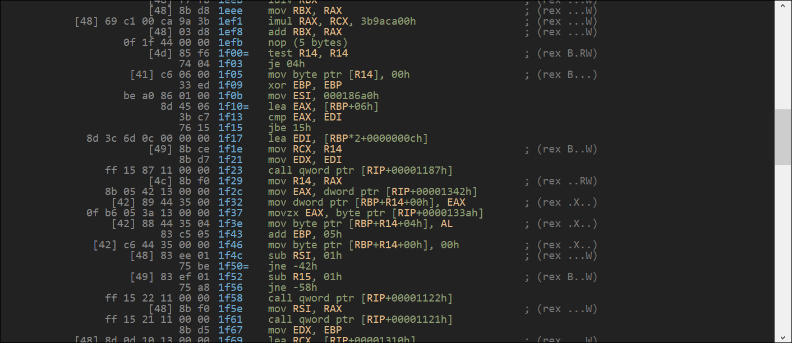

# X86_86 Disassembler

## Screenshots

## Status

Currently disassembles most x64_64 instructions but needs a lot more testing. Can only read Windows PE executables at the moment.

## Todo

- [ ] FPU
- [ ] Add imports

## Requirements
- Dlang https://dlang.org/
